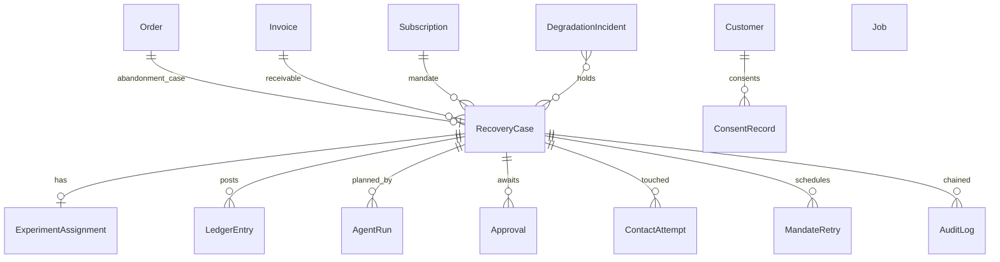

# RevenueShield v2 — Architecture

RevenueShield is an autonomous, bounded revenue-recovery agent for Razorpay merchants. This document is
the walkthrough a reviewer needs to read the code: what the pieces are, how a leak flows through them,
where the AI is allowed to decide and where it is not, and how the system measures itself.

## 1. System context

```mermaid
flowchart LR
  subgraph Razorpay
    WH[Webhooks<br/>payment.* order.* invoice.*<br/>subscription.* refund.* settlement.*]
    API[REST<br/>Payment Links · Settlements recon]
  end
  subgraph RevenueShield
    ING[Ingestion<br/>HMAC verify · normalise · idempotent Event]
    DET[Detectors<br/>payment failure · checkout · receivables · mandates]
    CF[CaseFactory<br/>audit · arm · ledger AT_RISK · diagnosis · NBA · plan · job]
    DEG[Degradation monitor<br/>bank x method matrix]
    AG[Recovery Agent<br/>LLM planner (GPT-4o / Claude) + NullLLM fallback]
    POL[Policy engine + ContactPolicy<br/>RBI window · consent · DND · caps · holdout · hold]
    EXE[Executors<br/>WhatsApp · email · voice · payment link · plan offer]
    OUT[Outcome engine<br/>capture -> RECOVERED -> stop everything]
    LED[Ledger<br/>AT_RISK · RECOVERED · REFUNDED · SETTLED · COST]
    SC[Scorecard<br/>lift · CI · p · violations · audit coverage]
    AUD[Hash-chained audit log]
    JOBS[Outbox + worker]
    UI[Command Center v2]
  end
  WH --> ING --> DET --> CF
  CF --> AG --> POL --> EXE --> API
  EXE --> TW[Twilio · SMTP]
  API --> WH --> OUT --> LED --> SC --> UI
  DEG --> POL
  CF --> JOBS --> AG
  POL --> AUD
  EXE --> AUD
  OUT --> AUD
```

## 2. Module map (backend/app)

| Package | Responsibility | Key entry points |
|---|---|---|
| `integrations/razorpay` | Signature verification, payload normalisation for every entity family, Payment Links client (partial payments), settlement recon | `security.py`, `adapter.py`, `payment_link_client.py` |
| `services/event_processor.py` | Idempotent ingestion, customer/payment resolution, routing to detectors, capture/refund/settlement handling | `EventProcessor.process_normalized_event` |
| `detectors/` | One detector per leak surface; `CaseFactory` opens every case identically; `SurfaceEventRouter` dispatches order/invoice/subscription events | `case_factory.py`, `checkout_abandonment.py`, `receivables.py`, `mandates.py` |
| `domain/surfaces.py` | `LeakSurface` enum and bounded recovery profile per surface (touch caps, voice/retry/escalation allowed) | `profile_for()` |
| `diagnosis/` | Deterministic root-cause rules, risk score, heuristic recovery probability | `RuleEngine`, `DiagnosisService` |
| `decision/` | Rule-based next-best-action scoring and the **PolicyEngine** (stopping rules, PTP, caps, RBI call window, surface profiles, holdout, degradation hold) | `engine.py`, `policy.py`, `service.py` |
| `ml/` | Recovery-probability model, action model, point-in-time features, registry, drift, retraining | `prediction_service.py`, `registry.py` |
| `experiments/` | Deterministic treatment/holdout assignment (sha256 bucket), holdout guards | `ExperimentAssigner` |
| `ledger/` | Append-only money ledger and settlement reconciliation | `LedgerService`, `SettlementReconciliationService` |
| `analytics/` | Batch scorecard: arms, lift, z-test, bootstrap CI, cost, compliance, audit coverage | `ScorecardService`, `stats.py` |
| `degradation/` | Rolling failure matrix vs baseline, incident state machine, case hold/release | `DegradationMonitor` |
| `compliance/` | Consent ledger + opt-out keywords, TRAI DND registry, unified `ContactPolicy`, human handoff | `contact_policy.py`, `consent.py`, `handoff.py`, `dnd.py` |
| `audit/` | Hash chain hook and verifier | `AuditChain` |
| `agent/` | Dossier, bounded toolbox, providers (OpenAI, Anthropic, Null; shared prompt), validators, runner, approvals | `runner.py`, `tools.py`, `validators.py`, `providers/` |
| `execution/`, `outcomes/`, `learning/` | v1 execution guard + executors, outcome/attribution engine, learning dataset | `ExecutionGuard`, `OutcomeEngine` |
| `services/*` (v1) | WhatsApp, email, voice, intervention (payment link), scheduler, promise-to-pay, message templates | `recovery_scheduler.py`, `whatsapp_recovery_service.py`, `voice_*` |
| `simulation/` | Scenario generator, customer behaviour model, virtual-clock replay, report | `BatchReplay` |
| `jobs/` | Transactional outbox, handlers, recurring ticks, worker | `JobQueue`, `Worker` |
| `observability/` | JSON logs with request ids and PII masking, Prometheus metrics, optional OTel | `logging.py`, `metrics.py` |
| `api/` | FastAPI routers (v1 + v2) | `__init__.py` |

## 3. Life of a leak

1. **Webhook arrives** at `POST /webhooks/razorpay`. HMAC-SHA256 is verified on the raw body before JSON parsing.
   `RazorpayAdapter.normalize` turns any entity family into a `NormalizedEvent`. `EventProcessor` refuses
   duplicates by `x-razorpay-event-id` (and by a DB unique constraint under a race).
2. **Detection.** `payment.failed` opens a `PAYMENT_FAILURE` case (or `CHECKOUT_ABANDONMENT` when the reason is a
   user cancellation on an order). `subscription.pending/halted` open mandate cases; `invoice.expired` opens a
   receivable case; sweeps catch quiet orders and past-due invoices. If the bank/method cell is inside an active
   degradation incident, the case is stamped `systemic_hold` and diagnosed `SYSTEMIC_ISSUER_DEGRADATION`.
3. **CaseFactory bootstrap** (identical for every surface): audit `RECOVERY_CASE_OPENED`, experiment arm, ledger
   `AT_RISK`, diagnosis, rule/ML recommendation, learning snapshot, bounded plan (max steps = surface touch cap),
   and a `plan.evaluate` job in the same transaction.
4. **Planning.** The worker's `plans.process_due` tick (or the API) evaluates the plan. With `AGENT_DRIVES_PLANS`
   the **Recovery Agent** builds a dossier (facts + precomputed verdicts per action), asks the planner (GPT-4o or Claude, or
   the deterministic Null planner), executes at most a handful of gated tool calls, and receives a structured
   `AgentPlan`. Without it, the v1 NBA engine picks the step.
5. **Gating.** Every mutating action passes: holdout/handoff freeze -> `PolicyEngine` (case state, PTP, caps,
   RBI window, surface profile, degradation hold) -> `ContactPolicy` (consent ledger, DND registry, contact window,
   holidays, cross-channel frequency) -> the channel service's own idempotency and stopping rules. Messages the
   LLM wrote pass `MessageValidator` (amount match, no internal vocabulary, no intimidation, opt-out footer) or
   fall back to the approved template. Actions above thresholds create an `Approval` for a human.
6. **Execution** in dry-run or live mode: WhatsApp/email/voice via Twilio/SMTP, payment links (optionally
   partial for instalment offers) via Razorpay. Every touch posts a `COST` ledger entry and a `ContactAttempt`.
7. **Outcome.** `payment.captured` / `order.paid` / `invoice.paid` / `subscription.charged` reach the
   `OutcomeEngine`: the case becomes `RECOVERED`, every pending step/intervention/message is cancelled, PTPs are
   fulfilled, the ledger gets `RECOVERED_*`, attribution and time-to-recovery are recorded, the learning example
   is finalised. Settlement recon later posts `SETTLED`.
8. **Measurement.** `GET /scorecard` computes, per batch or window, treatment vs holdout recovery, absolute and
   relative lift, z-test p-value, bootstrap CI on incremental rupees, cost per recovered rupee, policy
   violations (expected 0), audit coverage (expected 100%), and the audit-chain verification.

## 4. Where AI decides, and where it does not

| Decision | Who decides | Why |
|---|---|---|
| Is this leak the customer's or the bank's? | Deterministic monitor + rules | Statistics over the portfolio; must be explainable |
| Which action, which channel, what words | LLM planner (GPT-4o or Claude) | Judgment over a rich dossier; cheap to be wrong because everything downstream checks it |
| May this action run now? | PolicyEngine + ContactPolicy (code) | Regulation and merchant rules; must be exact and auditable |
| Are these words allowed to reach a customer? | MessageValidator (code) | Amounts, disclosures, tone are non-negotiable |
| Offer instalments / waive fees / call a large account / escalate | Envelope (code) + human approval | Money and reputation |
| Did we recover money? | Gateway webhooks + ledger | Never inferred |
| Did the system cause it? | Holdout experiment | Only a control group can answer that |

When the model is unreachable (429, 5xx, timeout, refusal, content filter) a circuit breaker opens and the run degrades to the Null
planner, which emits the same `AgentPlan` schema from the rule/ML recommendation. The trace records
`degraded_to_rules=true` so the scorecard can compare planners.

## 5. Data model (v2 additions)



`RecoveryCase` gained `experiment_arm`, `batch_id`, `leak_surface`, `case_metadata`. `AuditLog` gained
`sequence`, `prev_hash`, `row_hash`. Migrations 0015-0020 are idempotent (they inspect before altering).

## 6. Failure modes and what happens

| Failure | Behaviour |
|---|---|
| Duplicate / replayed webhook | `duplicate` result, zero side effects (measured by the replay harness) |
| Razorpay Payment Links API down or quota hit | client retries with backoff; test-mode link reuse; dry-run fallback |
| Twilio/SMTP transient error | retry with exponential backoff; auth errors are not retried; job retries later |
| LLM unavailable or refusing | circuit breaker opens 60s; deterministic planner; trace flags degradation |
| Issuer/PSP outage | incident opens; affected cases held (no touch consumed); systemic diagnosis; jittered release |
| Customer says STOP / "do not call" / wrong number / dispute | consent ledger write, plan paused or frozen, every channel blocked |
| Operator ignores an approval | expires at SLA; run marked BLOCKED with `APPROVAL_EXPIRED` |
| Worker crash mid-job | lock expires; another worker reclaims; attempts counted; DEAD after max attempts |
| Audit row edited | `/audit/verify` reports the first broken link; scorecard shows chain BROKEN |

## 7. Running it

- Tests: `make test` (406 tests, SQLite in-memory). Lint: `make lint` (ruff correctness rules).
- Replay: `make replay` writes `reports/<batch>.json|md` from a throwaway SQLite database, no external services.
- Full stack: `make up` (Postgres + API + worker), `make demo` replays over HTTP with real HMAC signatures.
- UI: `cd frontend-next && npm install && npm run dev` -> http://localhost:3000 (API base configurable).

See `newplan.md` for the phased build log, `decision.md` for every design decision with alternatives, and
`POSTMORTEMS.md` for what broke and how it was fixed.

## 8. Engineering rules that fell out of the postmortems

1. **Every time-based rule takes a `reference_time`.** Scheduler, agent toolbox, WhatsApp/email/voice services,
   contact policy and ledger all accept a clock so the replay harness and tests can run on virtual time (PM-006, PM-008).
2. **A measurement harness must be allowed to fail.** Errors abort the replay with the plan id; nothing is rolled
   back and papered over (PM-005).
3. **Provider callbacks are tested with the provider's content type.** Twilio form bodies go through the real
   endpoint in tests (PM-002, PM-003).
4. **Correctness lint is part of done.** `ruff` with undefined-name and redefinition rules runs in CI (PM-007).
5. **Anything that can touch a customer is enumerated and guarded**, and the scorecard counts leaks as violations (PM-001).
