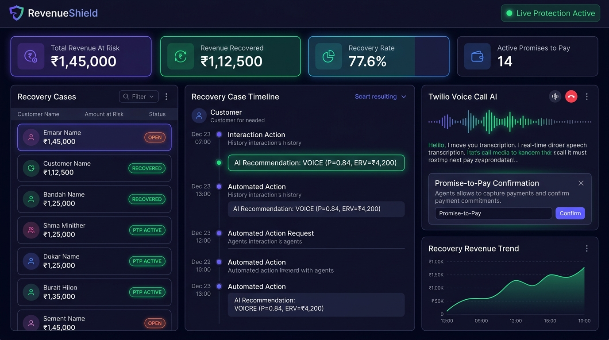
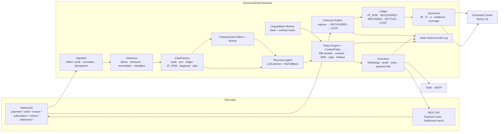
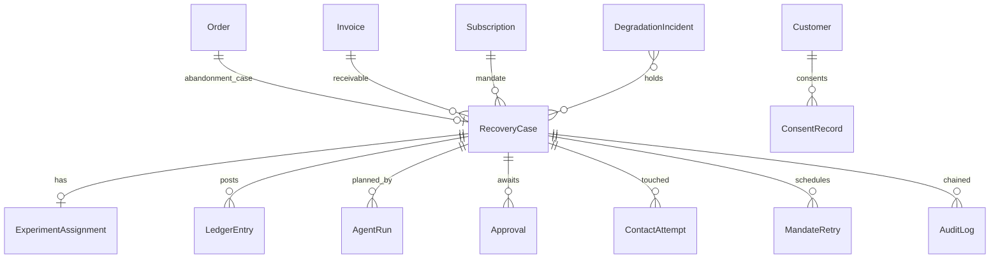

<div align="center">

# 🛡️ RevenueShield

### AI Revenue Recovery that *proves* what it recovered

**Razorpay AI Buildathon — Track 3 (AI Revenue Recovery)**
*"Find revenue that's slipping away and win it back."*

[]()
[]()
[]()
[]()
[]()

</div>

---

## The one-paragraph pitch

Most recovery tools send a reminder and call whatever comes back "recovered." **RevenueShield** assigns every
leaking rupee to a *treatment* or a *holdout* arm with a deterministic hash, recovers through bounded, compliant
escalation, **stops the moment the money lands**, and reports the **incremental** money it actually *caused* to
come back — with a confidence interval, a p-value, a settlement reconciliation, and a tamper-evident audit trail.
An LLM decides *what to say and when*; deterministic code decides *everything that must be correct*.

<p align="center">
  
</p>

---

## 📊 Results — measured on a 1,000-case batch

Reproduce with `make replay` (~4 minutes, no keys, no Docker). Full report: [`reports/demo_batch_1000.md`](reports/demo_batch_1000.md).

| Arm | Cases | Recovered | Recovery rate | At risk | Recovered & settled |
|---|---:|---:|---:|---:|---:|
| **Treatment** | 878 | 380 | **43.3%** | ₹1.64 Cr | ₹68.3 L |
| **Holdout** (15%, observe only) | 167 | 39 | 23.4% | ₹14.8 L | ₹2.2 L |

| What the judges asked for | Result |
|---|---|
| **Measured money recovered** | **₹43.7 L incremental** (95% CI ₹14.1 L–₹67.9 L), lift **+19.9 pts**, z = 4.82, **p < 1e-6** |
| Lift on every surface | Payment failures **+22.6 pts** · mandates +9.7 · checkout +17.4 · receivables +27.2 |
| Compliant escalation | **0 policy violations**, 0 holdout contacts, 64 opt-outs honoured across every channel |
| Stopping rules | 0 messages after recovery; 87 cases held during an issuer outage; 12 failures diagnosed systemic |
| Audit trail | **100%** of 878 executed actions audited; **19,515-row SHA-256 hash chain intact** |
| Failure recovery | 111 duplicate webhooks → 0 side effects; 354 agent runs degraded to the rules planner during a simulated LLM outage |

> Every number is computed from the append-only ledger and audit tables by `GET /scorecard` — **not** from the simulator.

---

## 🎯 The problem, and the four leak surfaces

Revenue doesn't leak in one place. RevenueShield models **four surfaces** with one case model, one policy engine, and one scorecard:

| Surface | Detected from | Recovery playbook |
|---|---|---|
| 💳 **Payment failure** | `payment.failed` webhooks, diagnosed into 9 root causes | Smart retry · WhatsApp / email / voice · payment link |
| 🔁 **Subscription mandate failure** | `subscription.pending` / `halted` | RBI-compliant retry with 24h pre-debit notice, salary-day alignment |
| 🛒 **Checkout abandonment** | `order.paid` never arrives, or user cancels | Gentle nudge within caps · resume link |
| 📄 **Receivable overdue** | Invoice import, ageing buckets | Reminder ladder · partial-payment links · instalment offers · escalation |

---

## 🏗️ System architecture

### 1. System context — how a leak flows end to end



### 2. Where AI decides — and where it deliberately does **not**

This is the core design thesis. The LLM is trusted with *judgment*; it is never trusted with *correctness*.

| Decision | Who decides | Why |
|---|---|---|
| Is this leak the customer's fault or the bank's? | Deterministic monitor + rules | Portfolio statistics; must be explainable |
| Which action, which channel, what words | **LLM planner (GPT-4o / Claude)** | Judgment over a rich dossier; cheap to be wrong — everything downstream re-checks it |
| May this action run *now*? | PolicyEngine + ContactPolicy (code) | Regulation + merchant rules; must be exact & auditable |
| Are these exact words allowed to reach a customer? | MessageValidator (code) | Amounts, disclosures, tone are non-negotiable |
| Offer instalments / waive fees / call a large account | Envelope (code) + **human approval** | Money and reputation |
| Did we recover money? | Gateway webhooks + ledger | **Never inferred** |
| Did *the system* cause it? | Holdout experiment | Only a control group can answer |

> When the model is unreachable (429, 5xx, timeout, refusal, content filter), a **circuit breaker** opens and the run degrades to a deterministic Null planner that emits the *same* `AgentPlan` schema. The trace records `degraded_to_rules=true` so the scorecard can compare planners.

### 3. Backend module map (`backend/app/`)

| Package | Responsibility | Key entry points |
|---|---|---|
| `integrations/razorpay` | Signature verify, payload normalisation, Payment Links, settlement recon | `security.py`, `adapter.py`, `payment_link_client.py` |
| `services/event_processor.py` | Idempotent ingestion, routing to detectors, capture/refund/settlement | `EventProcessor.process_normalized_event` |
| `detectors/` | One detector per surface; `CaseFactory` opens every case identically | `case_factory.py`, `checkout_abandonment.py`, `receivables.py`, `mandates.py` |
| `diagnosis/` | Deterministic root-cause rules, risk score, recovery probability | `RuleEngine`, `DiagnosisService` |
| `decision/` | Rule-based next-best-action + **PolicyEngine** (stopping rules, caps, RBI window, holdout) | `engine.py`, `policy.py` |
| `experiments/` | Deterministic treatment/holdout assignment (sha256 bucket) | `ExperimentAssigner` |
| `ledger/` | Append-only money ledger + settlement reconciliation | `LedgerService`, `SettlementReconciliationService` |
| `analytics/` | Scorecard: arms, lift, z-test, bootstrap CI, cost, coverage | `ScorecardService`, `stats.py` |
| `degradation/` | Rolling failure matrix vs baseline, incident state machine | `DegradationMonitor` |
| `compliance/` | Consent ledger, TRAI DND, `ContactPolicy`, human handoff | `contact_policy.py`, `consent.py`, `dnd.py` |
| `audit/` | Hash-chain hook + verifier | `AuditChain` |
| `agent/` | Dossier, bounded toolbox, providers (OpenAI/Anthropic/Null), validators, runner | `runner.py`, `tools.py`, `validators.py` |
| `simulation/` | Scenario generator, behaviour model, virtual-clock replay | `BatchReplay` |
| `jobs/` | Transactional outbox, handlers, recurring ticks, worker | `JobQueue`, `Worker` |
| `observability/` | JSON logs (request ids, PII masking), Prometheus, optional OTel | `logging.py`, `metrics.py` |

### 4. Life of a leak — the 8 steps

1. **Webhook arrives** at `POST /webhooks/razorpay`. HMAC-SHA256 verified on the *raw body* before parsing. Duplicates refused by event id + DB unique constraint.
2. **Detection.** `payment.failed` → `PAYMENT_FAILURE` (or `CHECKOUT_ABANDONMENT`); `subscription.*` → mandate case; `invoice.expired` → receivable. Cells inside an active degradation incident are stamped `systemic_hold`.
3. **CaseFactory bootstrap** (identical for every surface): audit `RECOVERY_CASE_OPENED`, experiment arm, ledger `AT_RISK`, diagnosis, recommendation, bounded plan, and a `plan.evaluate` job — all in one transaction.
4. **Planning.** The worker (or API) evaluates the plan. The **Recovery Agent** builds a dossier (facts + precomputed verdicts per action), asks the planner, executes a handful of gated tool calls, and returns a structured `AgentPlan`.
5. **Gating.** Every mutating action passes: holdout/handoff freeze → `PolicyEngine` → `ContactPolicy` (consent, DND, window, frequency) → the channel's own idempotency. LLM-written messages pass `MessageValidator` or fall back to the approved template. High-value actions create an `Approval`.
6. **Execution** (dry-run or live): WhatsApp/email/voice via Twilio/SMTP, payment links via Razorpay. Every touch posts a `COST` ledger entry + `ContactAttempt`.
7. **Outcome.** `payment.captured` / `order.paid` / `invoice.paid` → `OutcomeEngine`: case becomes `RECOVERED`, **every pending step is cancelled**, ledger gets `RECOVERED_*`, attribution recorded. Settlement recon later posts `SETTLED`.
8. **Measurement.** `GET /scorecard` computes treatment vs holdout recovery, absolute + relative lift, z-test p-value, bootstrap CI on incremental rupees, cost per recovered rupee, violations (expect 0), audit coverage (expect 100%), and chain verification.

### 5. Data model (v2 core entities)



---

## 🧰 Tech stack

| Layer | Technology |
|---|---|
| **Backend** | Python 3.13 · FastAPI · SQLAlchemy 2 · Alembic · Pydantic Settings |
| **Database** | PostgreSQL (prod) · SQLite (tests + offline replay) |
| **Async / jobs** | Transactional outbox + worker (SKIP LOCKED, backoff, dead-letter) |
| **AI** | OpenAI SDK (GPT-4o) · Anthropic SDK (Claude) · shared prompt + strict `submit_plan` schema |
| **ML** | scikit-learn · pandas · numpy · joblib (recovery-probability + action models) |
| **Messaging** | Twilio (WhatsApp / SMS / voice) · SMTP (email) |
| **Frontend** | Next.js 16 · TypeScript · Tailwind v4 |
| **Observability** | Prometheus `/metrics` · JSON logs w/ PII masking · optional OpenTelemetry |
| **Infra** | Docker Compose (Postgres + API + worker) · GitHub Actions CI |

---

## 🚀 Quickstart

### Offline, ~2 minutes, no keys, no Docker

```bash
# 1. Backend deps + tests
cd backend
python -m venv venv && source venv/bin/activate      # Windows: venv\Scripts\activate
pip install -r requirements.txt -r requirements-dev.txt
python -m pytest tests -q                             # 406 passed

# 2. Build the demo database (1,000 cases through the real pipeline)
cd .. && make replay                                  # writes reports/demo_batch_1000.{md,json}

# 3. Run the API on the replay database
cd backend
DATABASE_URL=sqlite:///../reports/replay_demo_1000.db EXPERIMENTS_ENABLED=true \
  uvicorn app.main:app --port 8000                    # http://127.0.0.1:8000/docs

# 4. Run the Command Center (new terminal)
cd frontend-next
cp .env.example .env.local && npm install && npm run dev   # http://localhost:3000
```

### Full stack (Postgres + API + worker over HTTP)

```bash
cp .env.example .env
make up            # docker compose: postgres + api + worker
make replay-http   # drives webhooks with real HMAC signatures
```

**Optional integrations** — set `OPENAI_API_KEY` (GPT-4o) or `ANTHROPIC_API_KEY` (Claude);
`LLM_PROVIDER=auto` picks whichever exists, else a deterministic planner. Set Razorpay test keys +
`EXECUTION_MODE=razorpay_test` to drive real test-mode webhooks. See [`docs/demo-runbook.md`](docs/demo-runbook.md).

---

## 🔌 Key endpoints

| Endpoint | Purpose |
|---|---|
| `POST /webhooks/razorpay` | HMAC-verified ingestion of payment, order, invoice, subscription, refund & settlement events |
| `GET /scorecard?batch_id=` | Arms, lift, CI, p-value, costs, compliance, audit coverage, per-surface lift |
| `GET /ledger/cases/{id}` · `POST /ledger/reconcile` | Case ledger & settlement reconciliation |
| `GET /degradation/health` · `/incidents` | Failure matrix & incident history |
| `GET /compliance/*` · `GET /audit/verify` | Consent, DND, contact attempts; hash-chain verification |
| `POST /agent/cases/{id}/run` · `GET /agent/runs/{id}` | Run the Recovery Agent, read its trace & cost |
| `GET /approvals` · `POST /approvals/{id}/decide` | Human approval queue |
| `POST /simulation/replay` | Run a seeded batch replay and get the scorecard |
| `GET /jobs/*` · `GET /metrics` · `GET /health/ready` | Outbox health, Prometheus metrics, readiness |

---

## 🖥️ Command Center

`frontend-next/` (Next.js 16 · TypeScript · Tailwind v4):

**Overview** · **Scorecard** (per-surface lift) · **Cases** & case detail (dossier, verdicts, agent traces,
ledger, hash-chained audit trail, run-agent & hand-off actions) · **Approvals** · **Agent runs** ·
**Degradation** matrix & incidents · **Replay** runner · **Jobs** · **Audit verify**.

---

## 🛡️ Failure modes

| Failure | Behaviour |
|---|---|
| Duplicate / replayed webhook | `duplicate` result, **zero side effects** |
| Razorpay Payment Links down | client retries w/ backoff; test-mode link reuse; dry-run fallback |
| Twilio / SMTP transient error | exponential backoff; auth errors not retried; job retries later |
| LLM unavailable or refusing | circuit breaker opens 60s; deterministic planner; trace flags degradation |
| Issuer / PSP outage | incident opens; affected cases held (no touch consumed); jittered release |
| Customer says STOP / wrong number / dispute | consent ledger write; plan frozen; every channel blocked |
| Worker crash mid-job | lock expires; another worker reclaims; `DEAD` after max attempts |
| Audit row edited | `/audit/verify` reports the first broken link; scorecard shows chain BROKEN |

---

## 📚 Documentation

| Doc | What's inside |
|---|---|
| [`ARCHITECTURE.md`](ARCHITECTURE.md) | System context, module map, life of a leak, data model, failure modes |
| [`demo.md`](demo.md) | The five-minute demo, minute by minute |
| [`newplan.md`](newplan.md) | The blueprint, phases 0–9 with progress log |
| [`decision.md`](decision.md) | D-001 to D-038, each with alternatives & rationale |
| [`POSTMORTEMS.md`](POSTMORTEMS.md) | PM-001 to PM-008 — what broke, root cause, fix, prevention |
| [`docs/measurement.md`](docs/measurement.md) · [`docs/compliance.md`](docs/compliance.md) · [`docs/agent.md`](docs/agent.md) | Rule → code → test |

---

## 📁 Repository layout

```
backend/app/        FastAPI app: detectors, decision, execution, agent, compliance,
                    degradation, experiments, ledger, analytics, simulation, jobs, observability
backend/alembic/    migrations 0001–0020
backend/tests/      406 tests (SQLite in-memory)
backend/scripts/    replay_batch.py, run_worker.py, live smoke scripts
frontend-next/      Command Center (Next.js 16)
frontend/           legacy portal served at /portal
reports/            replay reports & databases
docs/               design & operations documents
```

---

## 🔒 Security

HMAC-SHA256 verification on every webhook · PII masked in logs · secrets only in environment ·
internal endpoints behind `X-Internal-Secret` in production · explicit CORS allow-list · hash-chained audit log.

---

<div align="center">

**MIT License** · Built for the Razorpay AI Buildathon

</div>
