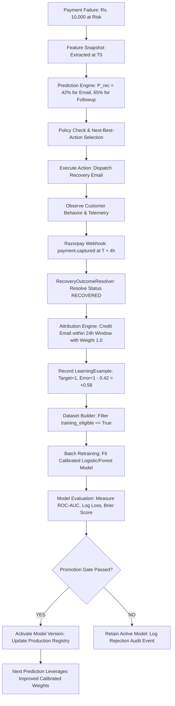

# Closed-Loop Learning Workflow

---

## The Closed Feedback Guarantee

1. **Prediction Traceability**: Every decision stores `prediction_id`, `model_version`, and feature values.
2. **Outcome Attribution**: Real webhook events link payments back to the triggering intervention.
3. **Continuous Auditing**: Prediction error ($y - \hat{p}$) and calibration curves are continuously monitored for distribution drift.
