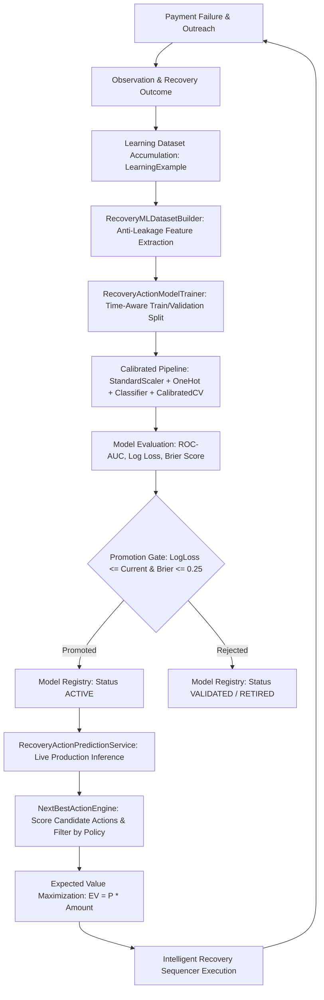

# Machine Learning Lifecycle Architecture

---

## The 9-Stage ML Lifecycle

1. **DATA COLLECTION**: Completed recovery interventions record point-in-time state and outcome realization targets into `learning_examples`.
2. **FEATURE EXTRACTION**: `RecoveryMLDatasetBuilder` converts raw entities into structured tabular features with zero post-decision data leakage.
3. **TRAINING & CALIBRATION**: `RecoveryActionModelTrainer` fits regularized linear/tree models with probability calibration.
4. **VALIDATION**: Model is tested on out-of-time test partitions evaluating Log Loss, Brier Score, and ROC-AUC.
5. **REGISTRATION & QUALITY GATING**: `ModelRegistryService` verifies promotion criteria before activating any new version.
6. **PREDICTION**: `RecoveryActionPredictionService` evaluates all candidate actions for open recovery cases in $< 15\text{ms}$.
7. **ACTION**: Sequencer triggers optimal policy-approved action.
8. **MONITORING & DRIFT**: `ModelDriftDetector` computes Population Stability Index (PSI) to alert on feature/prediction drift.
9. **RETRAINING**: Scheduled batch retraining triggers whenever $\ge 50$ new validated examples accumulate.
