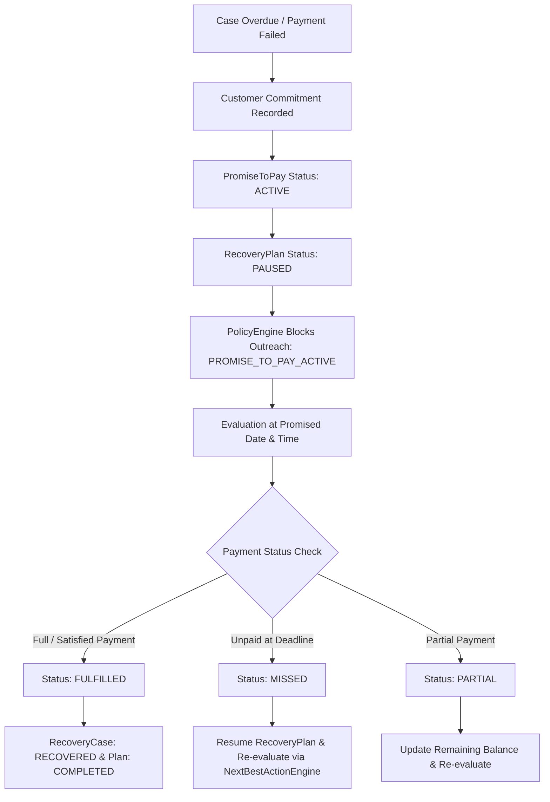

# Promise-to-Pay Workflow & Stopping Architecture

## 1. What Promise-to-Pay Means

**Promise-to-Pay** represents an explicit commitment from a customer to settle outstanding invoices by a designated future timestamp.

Example:
> *"I will pay my ₹25,000 invoice this Friday by 5:00 PM."*

When a Promise-to-Pay is recorded, the system immediately **HALTS all automated outreach reminders**. This prevents annoying, aggressive spamming and preserves positive customer trust while maintaining structured compliance.

---

## 2. The Promise-to-Pay Lifecycle

---

## 3. Validation & Stopping Rules

1. **Future Date**: The promised date must be strictly in the future (within `PROMISE_MAX_DAYS_AHEAD = 7` days).
2. **Valid Amount**: $0 < \text{Promised Amount} \le \text{Amount Due}$.
3. **Open Case**: Cannot create a promise for a case that is already `RECOVERED` or `CLOSED`.
4. **Policy Enforcement**: `PolicyEngine` checks `PromiseToPayService.has_active_promise(case_id)`. If true, all customer-facing reminders are blocked.

---

## 4. Auditing & Learning Features

- Emits audit events: `PROMISE_TO_PAY_CREATED`, `PROMISE_TO_PAY_VALIDATED`, `RECOVERY_PLAN_PAUSED_FOR_PROMISE`, `OUTREACH_BLOCKED_BY_PROMISE`, `PROMISE_TO_PAY_FULFILLED`, `PROMISE_TO_PAY_MISSED`, `RECOVERY_PLAN_RESUMED_AFTER_PROMISE`.
- Exposes customer-level feature: `promise_to_pay_fulfillment_rate` ($\text{fulfilled} / \text{completed}$).
