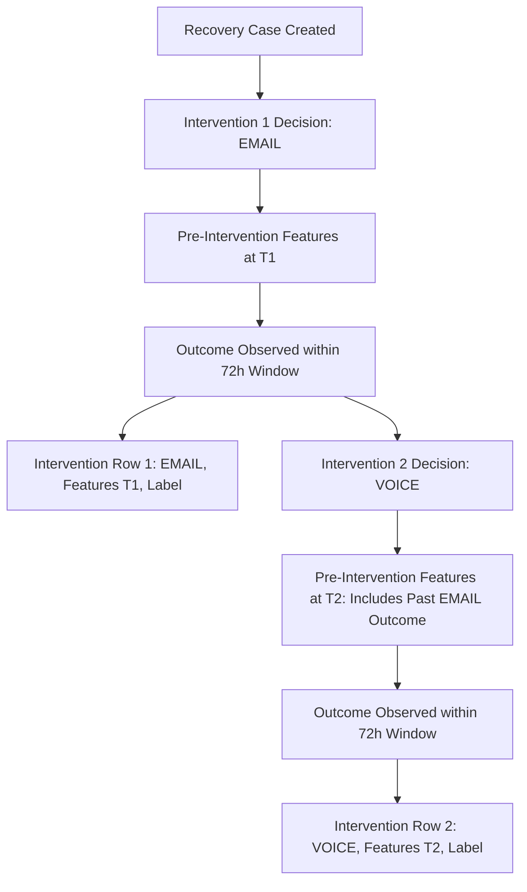

# ML Training Dataset & Pre-Intervention Feature Engineering Foundation

## 1. Overview & Next-Best-Action Architecture

The Next-Best-Action (NBA) engine is designed to optimize recovery outcomes by predicting:

$$\mathbb{P}(\text{RECOVERY} \mid \text{customer}, \text{failure}, \text{candidate\_intervention})$$

and evaluating expected recovery value:

$$\text{EXPECTED\_RECOVERED\_VALUE} = \mathbb{P}(\text{RECOVERY}) \times \text{amount\_at\_risk}$$

This enables the system to compare candidate channels and actions:
- `PAYMENT_RETRY` (Automated network/card retries)
- `EMAIL` (Payment recovery link and follow-ups)
- `VOICE` (Interactive voice assistant recovery calls)
- `WHATSAPP` (Instant messaging reminder)
- `NO_ACTION` (Grace period / passive wait)

---

## 2. Dataset Hierarchy & Lifecycle

The training dataset is structured at the **Intervention Level**, capturing each discrete outreach decision point rather than collapsing entire case lifecycles into a single row.

### Attribution & Label Definition

- **Primary Label (`recovered`)**:
  - `recovered = 1`: The recovery case was successfully paid (`payment.captured` or `status = "RECOVERED"`) within the **72-hour attribution window** following the intervention prediction timestamp ($T_{\text{intervention}} \le T_{\text{payment}} \le T_{\text{intervention}} + 72\text{h}$).
  - `recovered = 0`: No successful payment was captured within the 72-hour window following that specific intervention.
- **Continuous Metrics**:
  - `amount_recovered`: Monetary amount captured during the window.
  - `time_to_recovery_seconds`: Latency from intervention timestamp to payment capture timestamp ($T_{\text{payment}} - T_{\text{intervention}}$).

---

## 3. Pre-Intervention Feature Schema

To guarantee **zero data leakage**, feature extraction strictly uses state and events timestamped prior to $T_{\text{intervention}}$.

### A. Case Features
| Feature Name | Type | Description |
| :--- | :--- | :--- |
| `amount_at_risk` | float | Outstanding failed payment amount. |
| `currency` | categorical | ISO currency code (`INR`, `USD`, `EUR`, `GBP`, `OTHER`). |
| `days_overdue` | float | Elapsed days since invoice/payment due date. |
| `failure_code` | categorical | Gateway error code (e.g. `BAD_REQUEST_ERROR`, `INSUFFICIENT_FUNDS`). |
| `failure_category` | categorical | Diagnostic category (e.g. `INSUFFICIENT_FUNDS`, `AUTHENTICATION_FAILURE`, `TECHNICAL_ERROR`). |
| `payment_type` | categorical | Payment instrument (`card`, `upi`, `netbanking`, `wallet`, `emi`). |
| `is_subscription_or_invoice` | integer | Binary flag (1 for recurring subscription/invoice, 0 otherwise). |

### B. Customer Historical Features (Up to $T_{\text{intervention}}$)
| Feature Name | Type | Description |
| :--- | :--- | :--- |
| `customer_age_days` | float | Days elapsed between customer account creation and $T_{\text{intervention}}$. |
| `previous_successful_payments` | integer | Count of successful payments prior to $T_{\text{intervention}}$. |
| `previous_failed_payments` | integer | Count of failed payments prior to $T_{\text{intervention}}$. |
| `previous_recoveries` | integer | Count of previously resolved recovery cases. |
| `previous_promises_to_pay` | integer | Number of Promise-to-Pay commitments made historically. |
| `previous_ptp_fulfillment_rate` | float | Historical ratio of fulfilled PTPs over total PTPs ($0.0 \dots 1.0$). |
| `previous_voice_attempts` | integer | Prior voice calls made to customer before this step. |
| `previous_email_attempts` | integer | Prior recovery emails sent to customer before this step. |
| `previous_whatsapp_attempts` | integer | Prior WhatsApp messages sent before this step. |

### C. Timing & Context Features
| Feature Name | Type | Description |
| :--- | :--- | :--- |
| `hour_of_day` | integer | Hour of the day when intervention was chosen ($0 \dots 23$). |
| `day_of_week` | integer | Day of the week ($0 = \text{Monday}, \dots, 6 = \text{Sunday}$). |
| `days_since_failure` | float | Days elapsed between initial payment failure event and intervention. |

### D. Case Step History Features
| Feature Name | Type | Description |
| :--- | :--- | :--- |
| `previous_intervention_outcome` | categorical | Outcome status of the immediately preceding step on this case (`NONE`, `SUCCESS`, `FAILED`, `PENDING`). |
| `number_of_previous_recovery_attempts`| integer | Count of prior executed steps within the current case plan. |
| `previous_recovery_time_seconds` | float | Elapsed seconds of prior successful recovery if applicable. |

---

## 4. Anti-Leakage & Data Quality Controls

1. **Temporal Cutoff Enforcement**: Any event, payment, status update, or communication occurring after $T_{\text{intervention}}$ is strictly forbidden in feature vectors.
2. **Forbidden Keys Filter**: `validate_pre_intervention_features()` rejects any dictionary containing post-decision attributes (`amount_recovered`, `outcome_type`, `final_payment_status`, `is_recovered`, `time_to_recovery`).
3. **Data Quality Audits**:
   - Duplicate intervention IDs are dropped and tracked.
   - Future prediction timestamps ($T_{\text{pred}} > T_{\text{now}}$) are rejected.
   - Negative amounts and missing case associations are discarded and audited.
4. **Cold-Start Resilience**: When historical sample count is below minimum threshold ($\text{min\_samples} = 50$), the builder flags `insufficient_data = True` and avoids training uncalibrated models without fabricating synthetic data.
